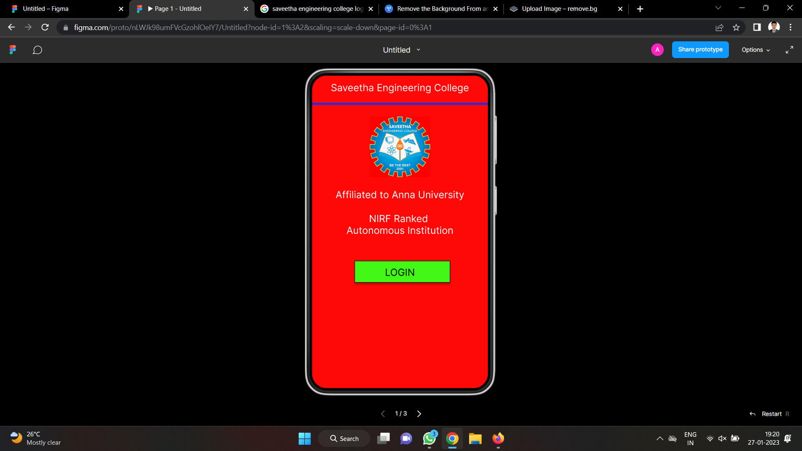
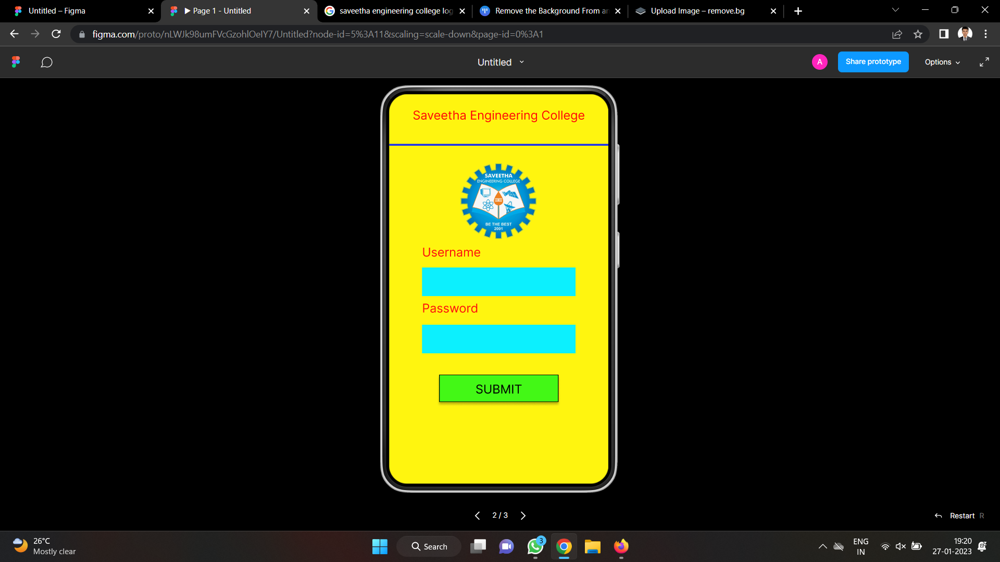
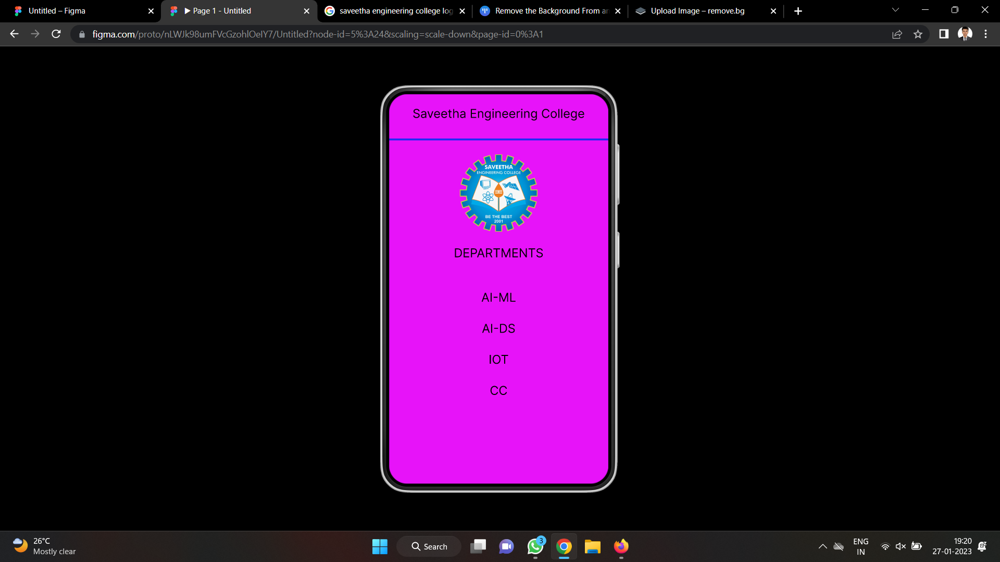

# Event Registration Web Application

## AIM:
To design, develop and deploy a web application for event registration.

## DESIGN STEPS:

### Step 1:
Create a new frame.

### Step 2:
Select any one preset size of your choice.

### Step 3:
Select the shapes you need.

### Step 4:
Import images as needed.

### Step 5:
Create pages based on your need and link them.

### Step 6:

Validate the HTML and CSS code.

### Step 6:

Publish the website in the given URL.

## DESIGN TOOL:
Figma

## code:
```
/* Home page */
position: relative;
width: 360px;
height: 640px;
background: #FF0808;

/* Login page */
position: relative;
width: 368px;
height: 647px;
background: #FFF50F;

/* Saveetha Engineering College */
position: absolute;
width: 338px;
height: 33px;
left: 11px;
top: 20px;
font-family: 'Inter';
font-style: normal;
font-weight: 400;
font-size: 20px;
line-height: 24px;
text-align: center;

color: #000000;


/* Line 3 */


position: absolute;
width: 368px;
height: 0px;
left: 0px;
top: 76px;
border: 3px solid #172DF5;

/* lo-removebg-preview (7) 1 */
position: absolute;
width: 128px;
height: 127px;
left: 116px;
top: 99px;
background: url(lo-removebg-preview (7).png);

/* DEPARTMENTS */
position: absolute;
width: 294px;
height: 50px;
left: 33px;
top: 249px;

font-family: 'Inter';
font-style: normal;
font-weight: 400;
font-size: 20px;
line-height: 24px;
text-align: center;
color: #000000;

/* AI-ML */
position: absolute;
width: 294px;
height: 43px;
left: 33px;
top: 322px;

font-family: 'Inter';
font-style: normal;
font-weight: 400;
font-size: 20px;
line-height: 24px;
text-align: center;
color: #000000;

/* AI-DS */
position: absolute;
width: 294px;
height: 43px;
left: 33px;
top: 373px;

font-family: 'Inter';
font-style: normal;
font-weight: 400;
font-size: 20px;
line-height: 24px;
text-align: center;
color: #000000;

/* IOT */
position: absolute;
width: 294px;
height: 43px;
left: 33px;
top: 424px;
font-family: 'Inter';
font-style: normal;
font-weight: 400;
font-size: 20px;
line-height: 24px;
text-align: center;

color: #000000;
/* CC */
position: absolute;
width: 294px;
height: 43px;
left: 33px;
top: 475px;
font-family: 'Inter';
font-style: normal;
font-weight: 400;
font-size: 20px;
line-height: 24px;
text-align: center;
color: #000000;
```

## OUTPUT:




## RESULT:
The program to design, develop and deploy a web application for event registration is completed successfully.